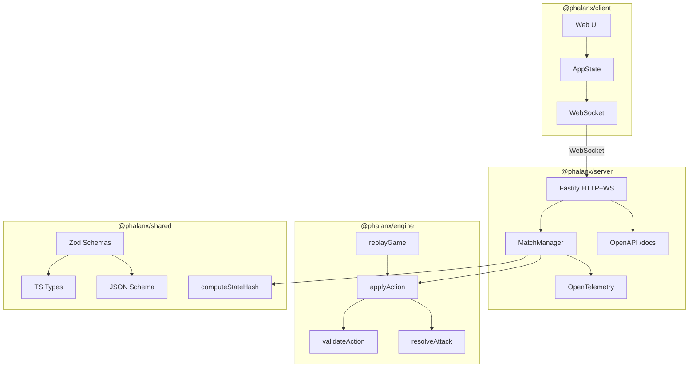

# Phalanx — Architecture

## Overview

Phalanx uses a **client-authoritative-server** architecture. The server is the
single source of truth for all game state. Clients send intents; the server
validates them against the rules engine and broadcasts the resulting state.

## Packages

### @phalanx/engine

Pure, deterministic rules engine. No I/O, no transport, no randomness (RNG is
injected). Every function takes a game state and an action, returns the next
state. This makes all transitions fully testable and replayable.

### @phalanx/server

Authoritative match server. Responsibilities:
- Accept client connections (HTTP + WebSocket)
- Validate actions through the engine
- Persist and broadcast state transitions
- Emit OpenTelemetry traces and metrics for every action
- Expose OpenAPI spec at `/docs` via `@fastify/swagger`
- Provide match replay validation via `GET /matches/:matchId/replay`

### @phalanx/client

Web UI. Sends player intents to the server, renders state received back. No
game logic — the client trusts the server's state.

### @phalanx/shared

Zod schemas as the single source of truth for data contracts. Generates:
- TypeScript types (`shared/src/types.ts`)
- JSON Schema snapshots (`shared/json-schema/*.json`)

Also contains the deterministic state hashing utility (`computeStateHash`).

## Game Phase State Machine

## Event Sourcing

Game state is derived from an ordered sequence of events (actions). Given the
same initial state and the same sequence of actions, the engine always produces
the same final state. This enables:

- **Replay**: reconstruct any game state from its event log via `replayGame()`.
- **Validation**: re-derive state independently to verify integrity.
- **Hash chain**: each `TransactionLogEntry` records `stateHashBefore` and
  `stateHashAfter`, forming a verifiable chain.
- **Observability**: trace every state transition with OpenTelemetry spans.

### Transaction Log Entry Structure

Every action produces a `TransactionLogEntry` containing:
- `sequenceNumber` — ordinal position in the log
- `action` — the action that was applied
- `stateHashBefore` / `stateHashAfter` — SHA-256 hashes (server-side)
- `timestamp` — ISO-8601 datetime
- `details` — discriminated union with action-specific audit data

The hash function is injected into `applyAction` so the engine remains
browser-safe (no `node:crypto` dependency). The server passes `computeStateHash`
from `@phalanx/shared/hash`.

## Data Flow

1. Client sends an action intent via WebSocket.
2. Server validates the action against current state using the engine.
3. Engine returns either the next state or a validation error.
4. Server persists the event and broadcasts the new state to all clients.
5. Each step is wrapped in an OpenTelemetry span (see OBSERVABILITY.md).
