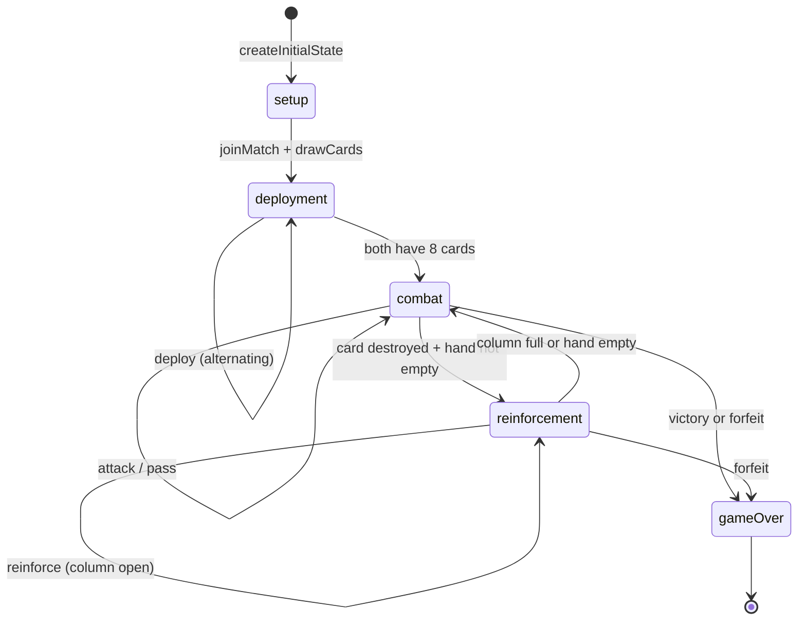

# Phalanx — Client Contract

A platform-agnostic guide for implementing a Phalanx client. Any WebSocket
client that speaks JSON can play — this document describes everything needed.

## Overview

Phalanx is a head-to-head card game played over WebSocket with a JSON protocol.
The server is authoritative: clients send action intents, the server validates
them through a deterministic rules engine, and broadcasts the resulting state.

- **Transport:** JSON over WebSocket (real-time), JSON over HTTP (match setup)
- **Authentication:** UUID-based (no tokens currently)
- **State model:** full GameState broadcast after every action

## Connection

**WebSocket URL:** `ws://<host>:3001/ws`

Frame format: each WebSocket message is a single JSON text frame. All messages
have a `type` string field as the discriminator.

**HTTP base URL:** `http://<host>:3001`

## Authentication Model

No auth tokens are used currently. On match creation or join, the server assigns
a `playerId` (UUID) and `playerIndex` (0 or 1). The client must store these
for reconnection.

## Client → Server Messages

There are 3 client message types:

### `createMatch`

```json
{ "type": "createMatch", "playerName": "Alice" }
```

| Field | Type | Required | Constraints |
|---|---|---|---|
| `type` | `"createMatch"` | yes | literal |
| `playerName` | string | yes | 1–50 characters |

### `joinMatch`

```json
{ "type": "joinMatch", "matchId": "uuid-...", "playerName": "Bob" }
```

| Field | Type | Required | Constraints |
|---|---|---|---|
| `type` | `"joinMatch"` | yes | literal |
| `matchId` | string | yes | UUID format |
| `playerName` | string | yes | 1–50 characters |

### `action`

```json
{
  "type": "action",
  "matchId": "uuid-...",
  "action": { "type": "deploy", "playerIndex": 0, "card": { "suit": "spades", "rank": "K" }, "column": 2 }
}
```

| Field | Type | Required | Constraints |
|---|---|---|---|
| `type` | `"action"` | yes | literal |
| `matchId` | string | yes | UUID format |
| `action` | Action | yes | discriminated union on `action.type` |

## Server → Client Messages

There are 7 server message types:

| Type | When sent |
|---|---|
| `matchCreated` | After `createMatch` — contains `matchId`, `playerId`, `playerIndex` |
| `matchJoined` | After `joinMatch` — contains `matchId`, `playerId`, `playerIndex` |
| `gameState` | After every state change — contains full `GameState` |
| `actionError` | When an action is rejected — contains `error`, `code` |
| `matchError` | When a non-action error occurs — contains `error`, `code` |
| `opponentDisconnected` | When the other player's connection drops |
| `opponentReconnected` | When the other player reconnects |

## GameState Structure

The `gameState` message contains the complete game state:

```
GameState {
  players: [PlayerState, PlayerState]  // index 0 and 1
  activePlayerIndex: 0 | 1             // whose turn it is
  phase: "setup" | "deployment" | "combat" | "reinforcement" | "gameOver"
  turnNumber: number
  rngSeed: number
  transactionLog: TransactionLogEntry[]
  outcome?: GameOutcome               // set when phase is "gameOver"
  reinforcement?: { column, attackerIndex }  // set during reinforcement
}

PlayerState {
  player: { id: string, name: string }
  hand: Card[]
  battlefield: (BattlefieldCard | null)[8]  // 0-3 = front row, 4-7 = back row
  drawpile: Card[]
  discardPile: Card[]
  lifepoints: number
}

Card { suit: "spades"|"hearts"|"diamonds"|"clubs", rank: "A"|"2"..."K" }

BattlefieldCard {
  card: Card
  position: { row: 0|1, col: 0|1|2|3 }
  currentHp: number
  faceDown: boolean
}
```

## Action Reference

### deploy (deployment phase)

Place a card from hand onto the battlefield. Column-based: fills front row
first, then back row.

```json
{ "type": "deploy", "playerIndex": 0, "card": { "suit": "spades", "rank": "K" }, "column": 2 }
```

- Valid when: `phase === "deployment"` and it's this player's turn
- Effect: card removed from hand, placed on battlefield at the column's first empty slot
- Phase transition: after 16 total deploys (8 per player), transitions to `combat`

### attack (combat phase)

Attack with a front-row card into the opposing column. Damage flows through:
front card -> back card -> player LP.

```json
{ "type": "attack", "playerIndex": 0, "attackerPosition": { "row": 0, "col": 1 }, "targetPosition": { "row": 0, "col": 1 } }
```

- Valid when: `phase === "combat"`, attacker is in front row, target column matches
- Effect: damage resolved through column overflow, cards may be destroyed
- Phase transition: may trigger `reinforcement` (if card destroyed and defender has hand cards)
  or `gameOver` (if victory condition met)

### pass (combat phase)

Skip your turn.

```json
{ "type": "pass", "playerIndex": 0 }
```

- Valid when: `phase === "combat"`
- Effect: turn passes to opponent, `turnNumber` increments

### reinforce (reinforcement phase)

Deploy a hand card to the damaged column during reinforcement.

```json
{ "type": "reinforce", "playerIndex": 1, "card": { "suit": "clubs", "rank": "4" } }
```

- Valid when: `phase === "reinforcement"` and card is in hand
- Effect: card placed in the reinforcement column (back row first)
- Phase transition: exits to `combat` when column is full or hand is empty;
  on exit, draws cards up to 4

### forfeit (combat or reinforcement phase)

Concede the game immediately.

```json
{ "type": "forfeit", "playerIndex": 0 }
```

- Valid when: `phase === "combat"` or `phase === "reinforcement"`
- Effect: opponent wins, transitions to `gameOver` with `victoryType: "forfeit"`

## Transaction Log

The `transactionLog` on GameState records every action with audit data:

```
TransactionLogEntry {
  sequenceNumber: number        // ordinal position
  action: Action                // the action applied
  stateHashBefore: string       // SHA-256 hash of state before (server-side)
  stateHashAfter: string        // SHA-256 hash of state after
  timestamp: string             // ISO-8601 datetime
  details: TransactionDetail    // discriminated union on details.type
}
```

Detail variants by action type:
- `deploy`: `{ type, gridIndex, phaseAfter }`
- `attack`: `{ type, combat: CombatLogEntry, reinforcementTriggered, victoryTriggered }`
- `pass`: `{ type }`
- `reinforce`: `{ type, column, gridIndex, cardsDrawn, reinforcementComplete }`
- `forfeit`: `{ type, winnerIndex }`

### Extracting Combat Details

To display a battle log, filter the transaction log for attack entries:

```
entries = transactionLog.filter(e => e.details.type === "attack")
combatData = entries.map(e => e.details.combat)
```

### Verification Invariants

- `log[N].stateHashAfter === log[N+1].stateHashBefore` (hash chain integrity)
- `sequenceNumber` values are sequential starting from 0
- Replaying all actions from the initial config produces the same final state

## Game Phase State Machine



## Error Handling

| Code | Context | Recommended action |
|---|---|---|
| `PARSE_ERROR` | Invalid JSON sent | Fix JSON serialization |
| `VALIDATION_ERROR` | Message doesn't match schema | Check message format |
| `MATCH_NOT_FOUND` | matchId doesn't exist | Return to lobby |
| `MATCH_FULL` | Match already has 2 players | Create a new match |
| `NOT_IN_MATCH` | Action sent before joining | Join a match first |
| `GAME_NOT_STARTED` | Action before both players joined | Wait for opponent |
| `PLAYER_MISMATCH` | Wrong playerIndex | Use stored playerIndex |
| `INVALID_ACTION` | Action invalid in current state | Check phase/turn |
| `ACTION_FAILED` | Engine rejected the action | Check action details |

## Reconnection Protocol

1. Detect WebSocket close event
2. Apply exponential backoff: 1s, 2s, 4s, ..., up to 30s max
3. Open new WebSocket to `ws://<host>:3001/ws`
4. Send `joinMatch` with stored `matchId` and `playerName`
5. Receive `gameState` with current game state
6. Opponent receives `opponentReconnected` notification

Store `matchId`, `playerId`, and `playerIndex` in localStorage or equivalent
for reconnection across page reloads.

## JSON Schema Files

Machine-readable schemas for all types are available in `shared/json-schema/`:
- `GameState.json`, `Action.json`, `TransactionLogEntry.json`, etc.
- These are JSON Schema draft-2020-12 and can be used for validation in any language.

## OpenAPI

The server exposes an auto-generated OpenAPI 3.1 specification:
- **Spec:** `GET /docs/json`
- **Swagger UI:** `GET /docs`

## Client Implementation Checklist

1. Connect to WebSocket at `ws://<host>:3001/ws`
2. Create or join a match (store `matchId`, `playerId`, `playerIndex`)
3. Render GameState on every `gameState` message
4. Display hand cards and allow deployment during `deployment` phase
5. Display battlefield and allow attack/pass during `combat` phase
6. Handle `reinforcement` phase (show hand, deploy to damaged column)
7. Handle `gameOver` phase (show winner, option to play again)
8. Display errors from `actionError` and `matchError` messages
9. Implement reconnection with exponential backoff
10. Display `opponentDisconnected` / `opponentReconnected` notifications

## Example: Minimal Session

```json
// Client A creates match
-> { "type": "createMatch", "playerName": "Alice" }
<- { "type": "matchCreated", "matchId": "abc-123", "playerId": "p1-uuid", "playerIndex": 0 }

// Client B joins
-> { "type": "joinMatch", "matchId": "abc-123", "playerName": "Bob" }
<- { "type": "matchJoined", "matchId": "abc-123", "playerId": "p2-uuid", "playerIndex": 1 }
<- { "type": "gameState", "matchId": "abc-123", "state": { "phase": "deployment", ... } }

// Client A deploys a card
-> { "type": "action", "matchId": "abc-123", "action": { "type": "deploy", "playerIndex": 0, "card": { "suit": "spades", "rank": "K" }, "column": 0 } }
<- { "type": "gameState", "matchId": "abc-123", "state": { "phase": "deployment", "activePlayerIndex": 1, ... } }

// ... 14 more deploys ...

// Combat begins, Client A attacks
-> { "type": "action", "matchId": "abc-123", "action": { "type": "attack", "playerIndex": 0, "attackerPosition": { "row": 0, "col": 0 }, "targetPosition": { "row": 0, "col": 0 } } }
<- { "type": "gameState", "matchId": "abc-123", "state": { "phase": "combat", ... } }

// Client B forfeits
-> { "type": "action", "matchId": "abc-123", "action": { "type": "forfeit", "playerIndex": 1 } }
<- { "type": "gameState", "matchId": "abc-123", "state": { "phase": "gameOver", "outcome": { "winnerIndex": 0, "victoryType": "forfeit", "turnNumber": 2 } } }
```
