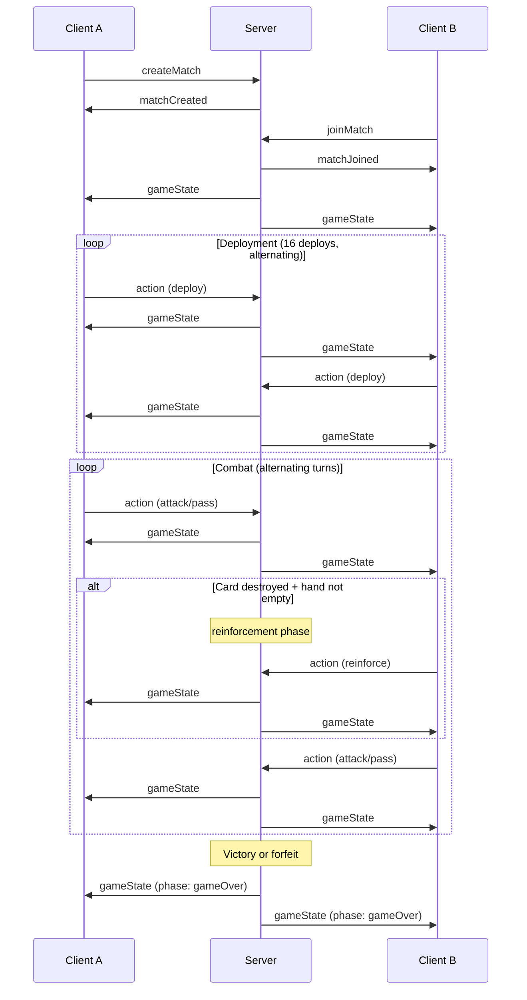
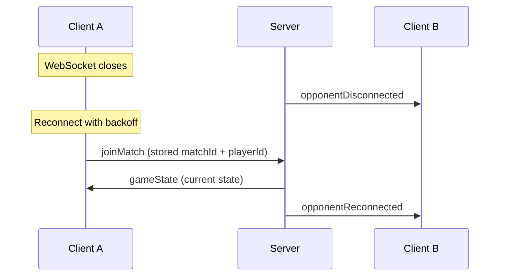

# Phalanx — Protocol Specification

Describes the wire protocol between client and server. All message schemas are
defined in `shared/src/schema.ts` and validated with Zod on both ends.

## Transport

- **HTTP/REST** — match creation (POST /matches), health checks (GET /health),
  match replay validation (GET /matches/:matchId/replay).
- **WebSocket** — all real-time game communication (match creation, joining,
  actions, state broadcasts, errors, disconnect/reconnect notifications).

Both transports use JSON payloads.

**OpenAPI:** The server exposes an auto-generated OpenAPI 3.1 spec at
`GET /docs/json` and Swagger UI at `/docs`.

---

## HTTP Endpoints

### GET /health

Returns server status.

```json
{
  "status": "ok",
  "timestamp": "2026-02-16T00:00:00.000Z",
  "version": "0.2.0"
}
```

### POST /matches

Creates a match slot and returns its ID. The match is not started until two
players have connected via WebSocket.

**Response (201):**

```json
{
  "matchId": "a1b2c3d4-e5f6-7890-abcd-ef1234567890"
}
```

### GET /matches/:matchId/replay

Replays and validates a match from its stored action history. Uses the
deterministic engine to re-apply all actions and verify the hash chain.

**Response (200):**

```json
{
  "valid": true,
  "actionCount": 42,
  "finalStateHash": "sha256-..."
}
```

**Error Response (404):**

```json
{
  "error": "Match not found",
  "code": "MATCH_NOT_FOUND"
}
```

---

## WebSocket Endpoint

**URL:** `ws://<host>/ws` (same-origin; in production served through Fastify on the same port as HTTP)

All messages are JSON objects with a `type` discriminator field. The server
validates incoming messages against `ClientMessageSchema` (Zod discriminated
union on `type`).

---

## Client → Server Messages

### `createMatch`

Create a new match. The server assigns the sender as player 0.

```json
{
  "type": "createMatch",
  "playerName": "Alice"
}
```

| Field | Type | Constraints |
|---|---|---|
| `playerName` | string | 1–50 characters |

**Server responds with:** `matchCreated`

### `joinMatch`

Join an existing match as player 1. Triggers game initialization and state
broadcast to both players.

```json
{
  "type": "joinMatch",
  "matchId": "a1b2c3d4-...",
  "playerName": "Bob"
}
```

| Field | Type | Constraints |
|---|---|---|
| `matchId` | string | UUID |
| `playerName` | string | 1–50 characters |

**Server responds with:** `matchJoined` to joining player, then `gameState` to
both players.

**Error cases:** `MATCH_NOT_FOUND`, `MATCH_FULL`

### `action`

Send a game action (deploy, attack, pass, reinforce, forfeit).

```json
{
  "type": "action",
  "matchId": "a1b2c3d4-...",
  "action": { "type": "deploy", "playerIndex": 0, "card": { "suit": "spades", "rank": "K" }, "column": 2 }
}
```

| Field | Type | Constraints |
|---|---|---|
| `matchId` | string | UUID |
| `action` | Action | Discriminated union on `action.type` |

**Action types:**

| Action | Fields | Phase |
|---|---|---|
| `deploy` | `playerIndex`, `card` (suit + rank), `column` (0–3) | deployment |
| `attack` | `playerIndex`, `attackerPosition` (row, col), `targetPosition` (row, col) | combat |
| `pass` | `playerIndex` | combat |
| `reinforce` | `playerIndex`, `card` (suit + rank) | reinforcement |
| `forfeit` | `playerIndex` | combat, reinforcement |

**Server responds with:** `gameState` broadcast to both players on success,
`actionError` to sender on failure.

---

## Server → Client Messages

### `matchCreated`

Sent to the player who created the match.

```json
{
  "type": "matchCreated",
  "matchId": "a1b2c3d4-...",
  "playerId": "p1-uuid-...",
  "playerIndex": 0
}
```

### `matchJoined`

Sent to the player who joined the match.

```json
{
  "type": "matchJoined",
  "matchId": "a1b2c3d4-...",
  "playerId": "p2-uuid-...",
  "playerIndex": 1
}
```

### `gameState`

Broadcast to both players after every state change (game start, action applied).
Contains the full `GameState` object.

```json
{
  "type": "gameState",
  "matchId": "a1b2c3d4-...",
  "state": {
    "players": ["..."],
    "activePlayerIndex": 0,
    "phase": "deployment",
    "turnNumber": 0,
    "rngSeed": 1707000000000,
    "transactionLog": [],
    "outcome": null
  }
}
```

The `transactionLog` array contains a `TransactionLogEntry` for every action
applied. Each entry includes the action, state hashes, timestamp, and
action-specific details (see `TransactionLogEntrySchema` in `shared/src/schema.ts`).

**Per-player filtering:** Each player receives a filtered state. The opponent's
`hand` and `drawpile` are redacted to empty arrays; `handCount` and `drawpileCount`
fields carry the counts. The player's own cards are always unredacted.

### `actionError`

Sent to the player whose action was rejected.

```json
{
  "type": "actionError",
  "matchId": "a1b2c3d4-...",
  "error": "Not this player's turn",
  "code": "INVALID_ACTION"
}
```

**Error codes:** `GAME_NOT_STARTED`, `PLAYER_NOT_FOUND`, `PLAYER_MISMATCH`,
`INVALID_ACTION`, `ACTION_FAILED`

### `matchError`

Sent for non-action errors (bad JSON, invalid message format, match not found).

```json
{
  "type": "matchError",
  "error": "Match not found",
  "code": "MATCH_NOT_FOUND"
}
```

**Error codes:** `PARSE_ERROR`, `VALIDATION_ERROR`, `MATCH_NOT_FOUND`,
`MATCH_FULL`, `CREATE_FAILED`, `JOIN_FAILED`, `NOT_IN_MATCH`

### `opponentDisconnected`

Sent when the other player's WebSocket closes.

```json
{
  "type": "opponentDisconnected",
  "matchId": "a1b2c3d4-..."
}
```

### `opponentReconnected`

Sent when the other player reconnects. The reconnecting player receives the
current `gameState` automatically.

```json
{
  "type": "opponentReconnected",
  "matchId": "a1b2c3d4-..."
}
```

---

## Connection Lifecycle



### Disconnect / Reconnect Flow



## Reconnection

The client uses exponential backoff (1s -> 2s -> 4s -> ... -> 30s max) to
reconnect on WebSocket close. After reconnecting, the client must re-send
a `joinMatch` with its stored `matchId` and `playerId` to resume. The server
sends the current `gameState` to the reconnecting player and notifies the
opponent via `opponentReconnected`.
