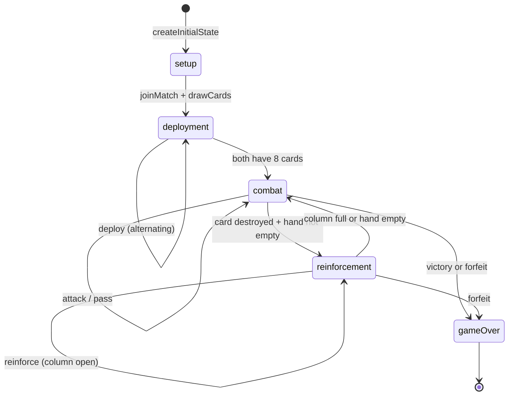

# Phalanx Duel — Client Contract

A platform-agnostic guide for implementing a Phalanx Duel client. Any WebSocket
client that speaks JSON can play — this document describes everything needed.

## Reference Implementation

The **web client** at `client/` in this repository is the reference implementation
of the Phalanx Duel client protocol. It is deployed at https://play.phalanxduel.com
and is the authoritative example of correct client behaviour.

Alternative clients — CLI tools, mobile apps, bots, tournament systems — can
implement the same JSON-over-WebSocket protocol described here and interoperate
fully with the same server. See [Alternative Clients](#alternative-clients) below.

## Overview

Phalanx Duel is a head-to-head card game played over WebSocket with a JSON protocol.
The server is authoritative: clients send action intents, the server validates
them through a deterministic rules engine, and broadcasts the resulting state.

- **Transport:** JSON over WebSocket (real-time), JSON over HTTP (match setup)
- **Authentication:** UUID-based (no tokens currently)
- **State model:** filtered `GameState` broadcast after every state change
- **Integrity:** every action is logged in a hash-chained `transactionLog`; games are deterministically replayable

## Connection

**WebSocket URL (production):** `ws://<host>/ws` or `wss://<host>/ws`

**WebSocket URL (local dev):** usually `ws://localhost:5173/ws` via Vite proxy
to the Fastify server on `localhost:3001`

Frame format: each WebSocket message is a single JSON text frame. All messages
have a `type` string field as the discriminator.

**HTTP base URL (production):** same origin as the client (for example `https://play.phalanxduel.com`)

## Authentication Model

No auth tokens are used currently. On match creation or join, the server assigns
a `playerId` (UUID) and `playerIndex` (0 or 1). The client should store
`matchId`, `playerName`, `playerIndex`, and `playerId`.

## Client → Server Messages

There are 4 client message types:

### `createMatch`

```json
{
  "type": "createMatch",
  "playerName": "Alice",
  "rngSeed": 20260220,
  "gameOptions": { "damageMode": "per-turn", "rngSeed": 20260220 }
}
```

| Field | Type | Required | Constraints |
|---|---|---|---|
| `type` | `"createMatch"` | yes | literal |
| `playerName` | string | yes | 1–50 characters |
| `rngSeed` | integer | no | safe integer, dev/test only |
| `gameOptions.damageMode` | string | no | `cumulative` or `per-turn` |
| `gameOptions.rngSeed` | integer | no | safe integer, dev/test only |

If both seed fields are sent, `gameOptions.rngSeed` is used.
In production (`NODE_ENV=production`), seeded requests are rejected with
`matchError` code `SEED_NOT_ALLOWED`.

### `joinMatch`

```json
{ "type": "joinMatch", "matchId": "uuid-...", "playerName": "Bob" }
```

| Field | Type | Required | Constraints |
|---|---|---|---|
| `type` | `"joinMatch"` | yes | literal |
| `matchId` | string | yes | UUID format |
| `playerName` | string | yes | 1–50 characters |

### `action`

```json
{
  "type": "action",
  "matchId": "uuid-...",
  "action": { "type": "deploy", "playerIndex": 0, "card": { "suit": "spades", "rank": "K" }, "column": 2 }
}
```

| Field | Type | Required | Constraints |
|---|---|---|---|
| `type` | `"action"` | yes | literal |
| `matchId` | string | yes | UUID format |
| `action` | Action | yes | discriminated union on `action.type` |

### `watchMatch`

```json
{ "type": "watchMatch", "matchId": "uuid-..." }
```

| Field | Type | Required | Constraints |
|---|---|---|---|
| `type` | `"watchMatch"` | yes | literal |
| `matchId` | string | yes | UUID format |

## Server → Client Messages

There are 8 server message types:

| Type | When sent |
|---|---|
| `matchCreated` | After `createMatch` — contains `matchId`, `playerId`, `playerIndex` |
| `matchJoined` | After `joinMatch` — contains `matchId`, `playerId`, `playerIndex` |
| `gameState` | After every state change — contains full `GameState` |
| `actionError` | When an action is rejected — contains `error`, `code` |
| `matchError` | When a non-action error occurs — contains `error`, `code` |
| `opponentDisconnected` | When the other player's connection drops |
| `opponentReconnected` | When the other player reconnects |
| `spectatorJoined` | After `watchMatch` — contains `matchId`, `spectatorId` |

## GameState Structure

The `gameState` message contains the complete game state:

```
GameState {
  players: [PlayerState, PlayerState]  // index 0 and 1
  activePlayerIndex: 0 | 1             // whose turn it is
  phase: "setup" | "deployment" | "combat" | "reinforcement" | "gameOver"
  turnNumber: number
  rngSeed: number
  transactionLog: TransactionLogEntry[]
  outcome?: GameOutcome               // set when phase is "gameOver"
  reinforcement?: { column, attackerIndex }  // set during reinforcement
}

PlayerState {
  player: { id: string, name: string }
  hand: Card[]
  battlefield: (BattlefieldCard | null)[8]  // 0-3 = front row, 4-7 = back row
  drawpile: Card[]
  discardPile: Card[]
  lifepoints: number
  handCount?: number
  drawpileCount?: number
}

Card { suit: "spades"|"hearts"|"diamonds"|"clubs", rank: "A"|"2"..."K" }

BattlefieldCard {
  card: Card
  position: { row: 0|1, col: 0|1|2|3 }
  currentHp: number
  faceDown: boolean
}
```

Filtering behavior:
- Player clients see their own `hand` and `drawpile`, while opponent card arrays
  are redacted and replaced by `handCount` / `drawpileCount`.
- Spectator clients see both players with redacted `hand` and `drawpile` arrays,
  with counts provided for each side.

## Action Reference

### deploy (deployment phase)

Place a card from hand onto the battlefield. Column-based: fills front row
first, then back row.

```json
{ "type": "deploy", "playerIndex": 0, "card": { "suit": "spades", "rank": "K" }, "column": 2 }
```

- Valid when: `phase === "deployment"` and it's this player's turn
- Effect: card removed from hand, placed on battlefield at the column's first empty slot
- Phase transition: after 16 total deploys (8 per player), transitions to `combat`

### attack (combat phase)

Attack with a front-row card into the opposing column. Damage flows through:
front card -> back card -> player LP.

```json
{ "type": "attack", "playerIndex": 0, "attackerPosition": { "row": 0, "col": 1 }, "targetPosition": { "row": 0, "col": 1 } }
```

- Valid when: `phase === "combat"`, attacker is in front row, target column matches
- Effect: damage resolved through column overflow, cards may be destroyed
- Phase transition: may trigger `reinforcement` (if card destroyed and defender has hand cards)
  or `gameOver` (if victory condition met)

### pass (combat phase)

Skip your turn.

```json
{ "type": "pass", "playerIndex": 0 }
```

- Valid when: `phase === "combat"`
- Effect: turn passes to opponent, `turnNumber` increments

### reinforce (reinforcement phase)

Deploy a hand card to the damaged column during reinforcement.

```json
{ "type": "reinforce", "playerIndex": 1, "card": { "suit": "clubs", "rank": "4" } }
```

- Valid when: `phase === "reinforcement"` and card is in hand
- Effect: card placed in the reinforcement column (back row first)
- Phase transition: exits to `combat` when column is full or hand is empty;
  on exit, draws cards up to 4

### forfeit (combat or reinforcement phase)

Concede the game immediately.

```json
{ "type": "forfeit", "playerIndex": 0 }
```

- Valid when: `phase === "combat"` or `phase === "reinforcement"`
- Effect: opponent wins, transitions to `gameOver` with `victoryType: "forfeit"`

## Transaction Log

The `transactionLog` on GameState records every action with audit data:

```
TransactionLogEntry {
  sequenceNumber: number        // ordinal position
  action: Action                // the action applied
  stateHashBefore: string       // SHA-256 hash of state before (server-side)
  stateHashAfter: string        // SHA-256 hash of state after
  timestamp: string             // ISO-8601 datetime
  details: TransactionDetail    // discriminated union on details.type
}
```

Detail variants by action type:
- `deploy`: `{ type, gridIndex, phaseAfter }`
- `attack`: `{ type, combat: CombatLogEntry, reinforcementTriggered, victoryTriggered }`
- `pass`: `{ type }`
- `reinforce`: `{ type, column, gridIndex, cardsDrawn, reinforcementComplete }`
- `forfeit`: `{ type, winnerIndex }`

### Extracting Combat Details

To display a battle log, filter the transaction log for attack entries:

```
entries = transactionLog.filter(e => e.details.type === "attack")
combatData = entries.map(e => e.details.combat)
```

### Verification Invariants

- `log[N].stateHashAfter === log[N+1].stateHashBefore` (hash chain integrity)
- `sequenceNumber` values are sequential starting from 0
- Replaying all actions from the initial config produces the same final state

## Game Phase State Machine



## Error Handling

| Code | Context | Recommended action |
|---|---|---|
| `PARSE_ERROR` | Invalid JSON sent | Fix JSON serialization |
| `VALIDATION_ERROR` | Message doesn't match schema | Check message format |
| `MATCH_NOT_FOUND` | matchId doesn't exist | Return to lobby |
| `MATCH_FULL` | Match already has 2 players | Create a new match |
| `WATCH_FAILED` | Spectator join failed | Verify matchId and retry |
| `NOT_IN_MATCH` | Action sent before joining | Join a match first |
| `GAME_NOT_STARTED` | Action before both players joined | Wait for opponent |
| `PLAYER_NOT_FOUND` | Action sent for unknown player | Recreate/join match |
| `PLAYER_MISMATCH` | Wrong playerIndex | Use stored playerIndex |
| `INVALID_ACTION` | Action invalid in current state | Check phase/turn |
| `ACTION_FAILED` | Engine rejected the action | Check action details |
| `RATE_LIMITED` | Too many websocket messages | Back off and retry |

## Reconnection Protocol

1. Detect WebSocket close event
2. Apply exponential backoff: 1s, 2s, 4s, ..., up to 30s max
3. Open new WebSocket to same-origin `/ws`
4. Send `joinMatch` with stored `matchId` and `playerName`
5. If match still has an open seat, receive `matchJoined` then `gameState`
6. If match is already full, receive `matchError` with `MATCH_FULL`

Current implementation note: `playerId` is stored client-side but is not part of
the reconnect message schema yet. Server-side player reattachment by `playerId`
is planned but not currently wired in the WebSocket handler.

## HTTP Endpoints

| Method | Path | Auth | Purpose |
|---|---|---|---|
| `GET` | `/health` | none | Server status: `{ status, timestamp, version }` |
| `POST` | `/matches` | none | Create a match slot: returns `{ matchId }` |
| `GET` | `/matches/:matchId/replay` | Basic Auth | Validate a finished match's hash chain: `{ valid, actionCount, finalStateHash }` |
| `GET` | `/docs` | none | Swagger UI — interactive API explorer |
| `GET` | `/docs/json` | none | OpenAPI 3.1 JSON spec |

**Health check:**
```bash
curl https://play.phalanxduel.com/health
# { "status": "ok", "timestamp": "...", "version": "0.2.0" }
```

**Replay validation** (admin, Basic Auth required):
```bash
curl -u admin:password https://play.phalanxduel.com/matches/<matchId>/replay
# { "valid": true, "actionCount": 42, "finalStateHash": "sha256-..." }
```

## Verification and Replay

Every `gameState` message carries a `transactionLog` — an ordered list of every
action applied since the start of the match. Each entry contains:

```
{ sequenceNumber, action, stateHashBefore, stateHashAfter, timestamp, details }
```

**Hash chain invariant:** `log[N].stateHashAfter === log[N+1].stateHashBefore`

**Replay algorithm** (plain English):
1. Reconstruct `GameConfig` from the final `gameState`:
   - `rngSeed` from `state.rngSeed`
   - `players` from `state.players[].player` (id + name)
   - `gameOptions` from `state.gameOptions`
2. Create initial state: shuffle decks with `rngSeed`, draw 12 cards per player
3. For each action in `transactionLog` (in `sequenceNumber` order), apply it
4. The resulting state at step N is the board position after action N

This is equivalent to chess PGN replay: the game record is `(config, actions[])`,
and any board position is recoverable by replaying moves 1..N.

## Alternative Clients

The Phalanx Duel server implements a platform-agnostic JSON protocol. Any environment
that can open a WebSocket and exchange JSON text frames can be a client.

### What's needed (required)

- WebSocket client (any language/runtime)
- JSON serialization/deserialization
- Store `matchId`, `playerId`, `playerIndex` after `matchCreated`/`matchJoined`
- Handle all 8 server message types (see Server -> Client Messages above)
- Send correct action types for the current `phase`

### What's optional

- Reconnection with exponential backoff (server holds state indefinitely during a match)
- Transaction log replay / hash verification (integrity feature, not required to play)
- Displaying opponent `handCount`/`drawpileCount` (provided for UI purposes)
- Spectator mode (`watchMatch`) if your client is player-only

### Machine-readable schemas

All types are available as JSON Schema draft-2020-12 in `shared/json-schema/`:

| File | Contents |
|---|---|
| `GameState.json` | Full game state structure |
| `Action.json` | All action types (discriminated union) |
| `TransactionLogEntry.json` | Log entry with hash fields and detail variants |
| `ClientMessage.json` | All client → server message types |
| `ServerMessage.json` | All server → client message types |

These schemas can be used for validation in any language (Python, Go, Rust, etc.)
via standard JSON Schema validators.

### Alternative client checklist

1. Connect to `ws://<host>/ws`
2. Send `createMatch` or `joinMatch`, store returned `matchId`/`playerId`/`playerIndex`
3. On each `gameState`, read `phase` and `activePlayerIndex` to determine valid actions
4. During `deployment`: send `action` with `type: "deploy"` for each card
5. During `combat`: send `attack`, `pass`, or `forfeit`
6. During `reinforcement`: send `reinforce`
7. On `gameOver`: read `outcome.winnerIndex` and `outcome.victoryType`
8. On `actionError` / `matchError`: surface the `error` string to the user
9. If supporting spectators, send `watchMatch` and handle `spectatorJoined`

## Client Implementation Checklist

1. Connect to WebSocket at `ws://<host>/ws`
2. Create or join a match (store `matchId`, `playerId`, `playerIndex`)
3. Render GameState on every `gameState` message
4. Display hand cards and allow deployment during `deployment` phase
5. Display battlefield and allow attack/pass during `combat` phase
6. Handle `reinforcement` phase (show hand, deploy to damaged column)
7. Handle `gameOver` phase (show winner, option to play again)
8. Display errors from `actionError` and `matchError` messages
9. Implement reconnection with exponential backoff
10. Display `opponentDisconnected` / `opponentReconnected` notifications
11. (Optional) Support `watchMatch` + `spectatorJoined` spectator flow

## Example: Minimal Session

```json
// Client A creates match
-> { "type": "createMatch", "playerName": "Alice" }
<- { "type": "matchCreated", "matchId": "abc-123", "playerId": "p1-uuid", "playerIndex": 0 }

// Client B joins
-> { "type": "joinMatch", "matchId": "abc-123", "playerName": "Bob" }
<- { "type": "matchJoined", "matchId": "abc-123", "playerId": "p2-uuid", "playerIndex": 1 }
<- { "type": "gameState", "matchId": "abc-123", "state": { "phase": "deployment", ... } }

// Client A deploys a card
-> { "type": "action", "matchId": "abc-123", "action": { "type": "deploy", "playerIndex": 0, "card": { "suit": "spades", "rank": "K" }, "column": 0 } }
<- { "type": "gameState", "matchId": "abc-123", "state": { "phase": "deployment", "activePlayerIndex": 1, ... } }

// ... 14 more deploys ...

// Combat begins, Client A attacks
-> { "type": "action", "matchId": "abc-123", "action": { "type": "attack", "playerIndex": 0, "attackerPosition": { "row": 0, "col": 0 }, "targetPosition": { "row": 0, "col": 0 } } }
<- { "type": "gameState", "matchId": "abc-123", "state": { "phase": "combat", ... } }

// Client B forfeits
-> { "type": "action", "matchId": "abc-123", "action": { "type": "forfeit", "playerIndex": 1 } }
<- { "type": "gameState", "matchId": "abc-123", "state": { "phase": "gameOver", "outcome": { "winnerIndex": 0, "victoryType": "forfeit", "turnNumber": 2 } } }
```

## Example: Spectator Session

```json
// Spectator joins an active match
-> { "type": "watchMatch", "matchId": "abc-123" }
<- { "type": "spectatorJoined", "matchId": "abc-123", "spectatorId": "s-uuid" }
<- { "type": "gameState", "matchId": "abc-123", "state": { "players": [{ "hand": [], "handCount": 4 }, { "hand": [], "handCount": 3 }], ... } }
```
